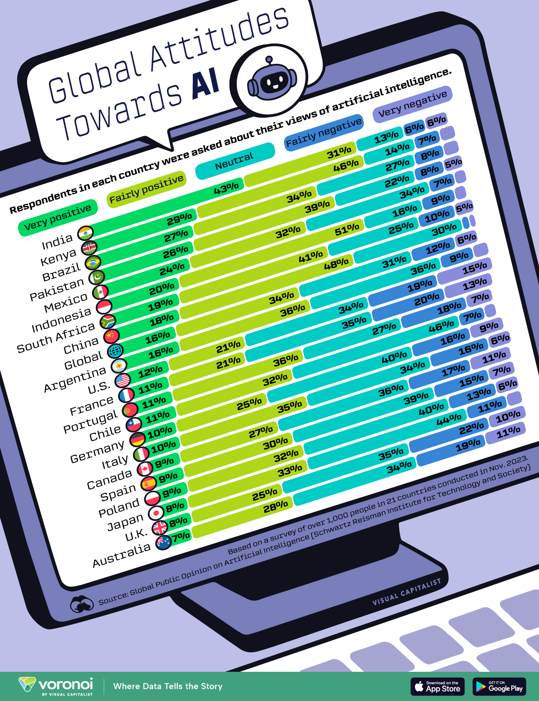
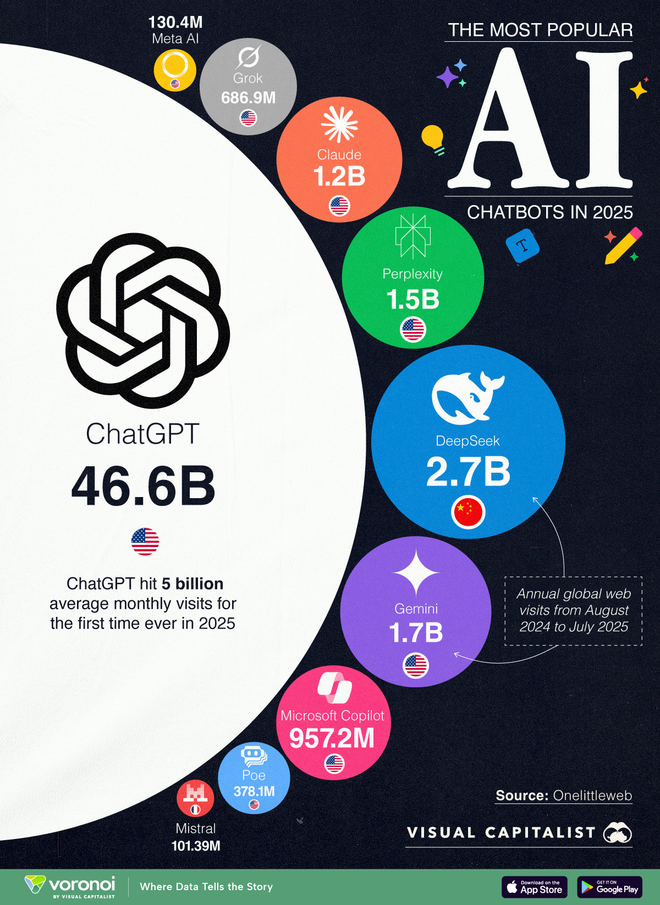
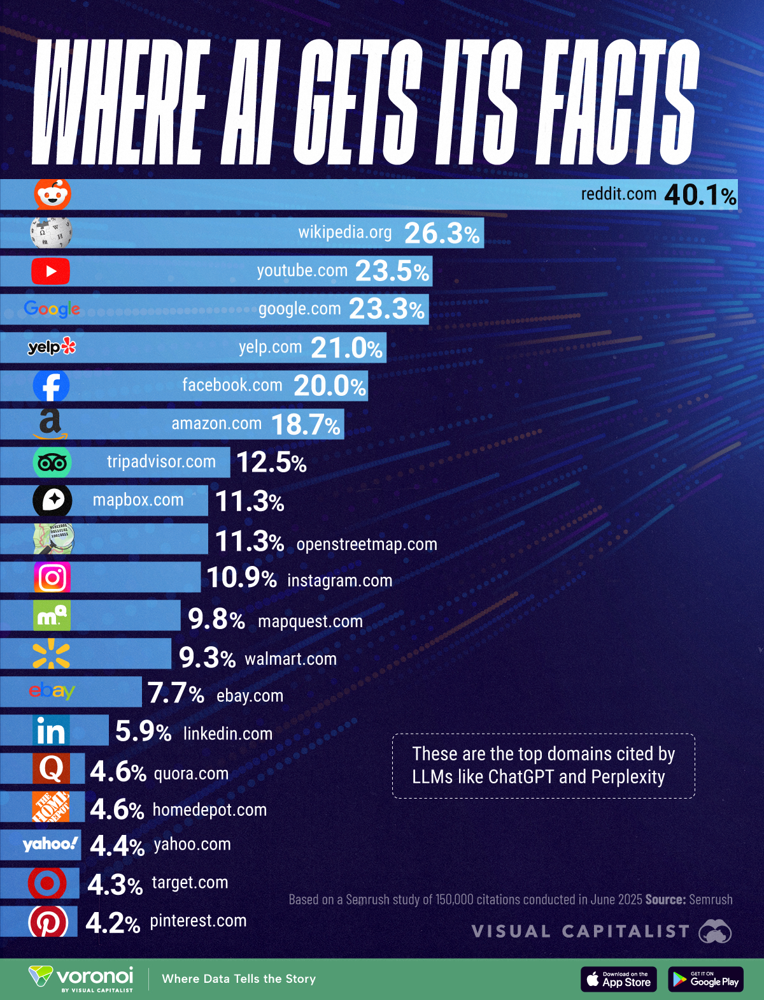
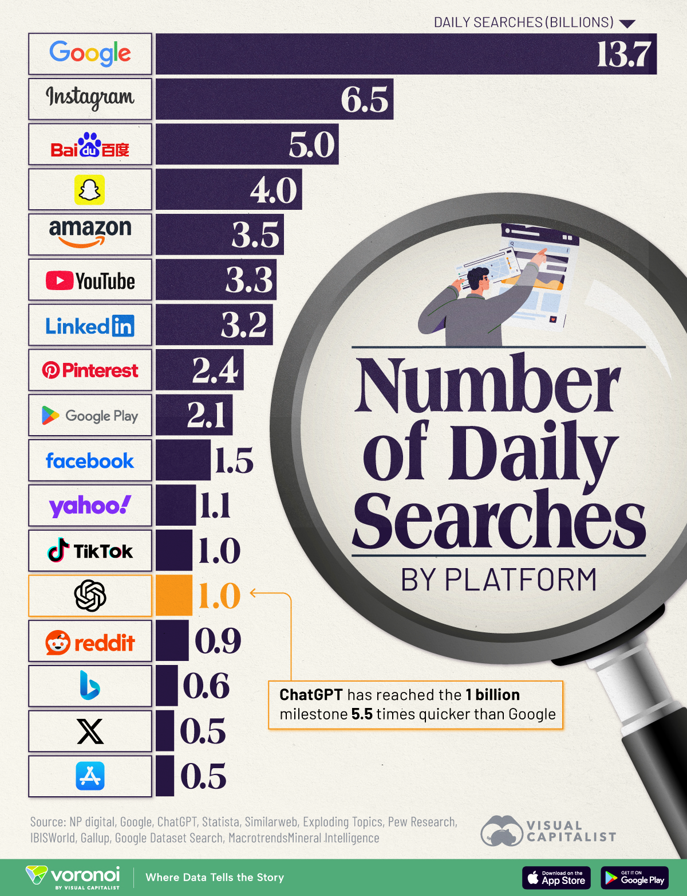
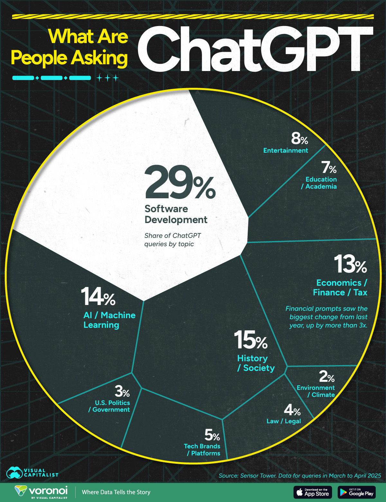
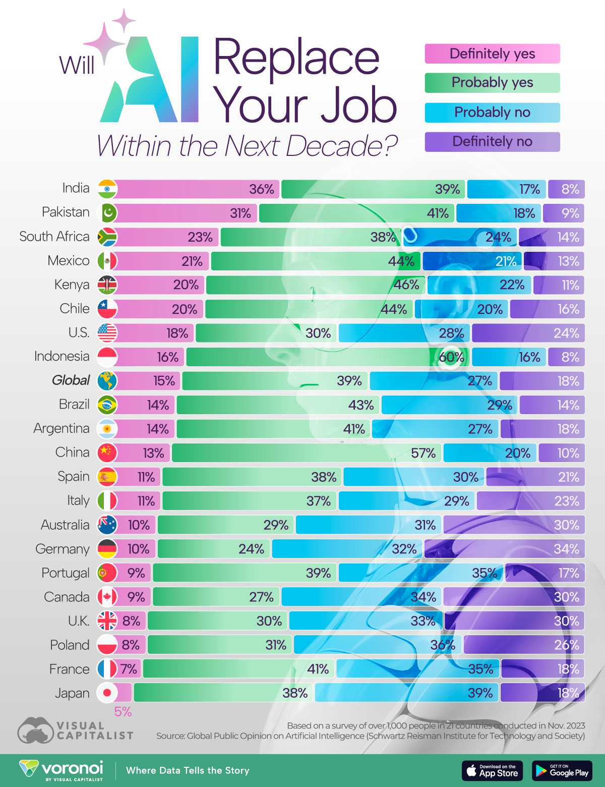
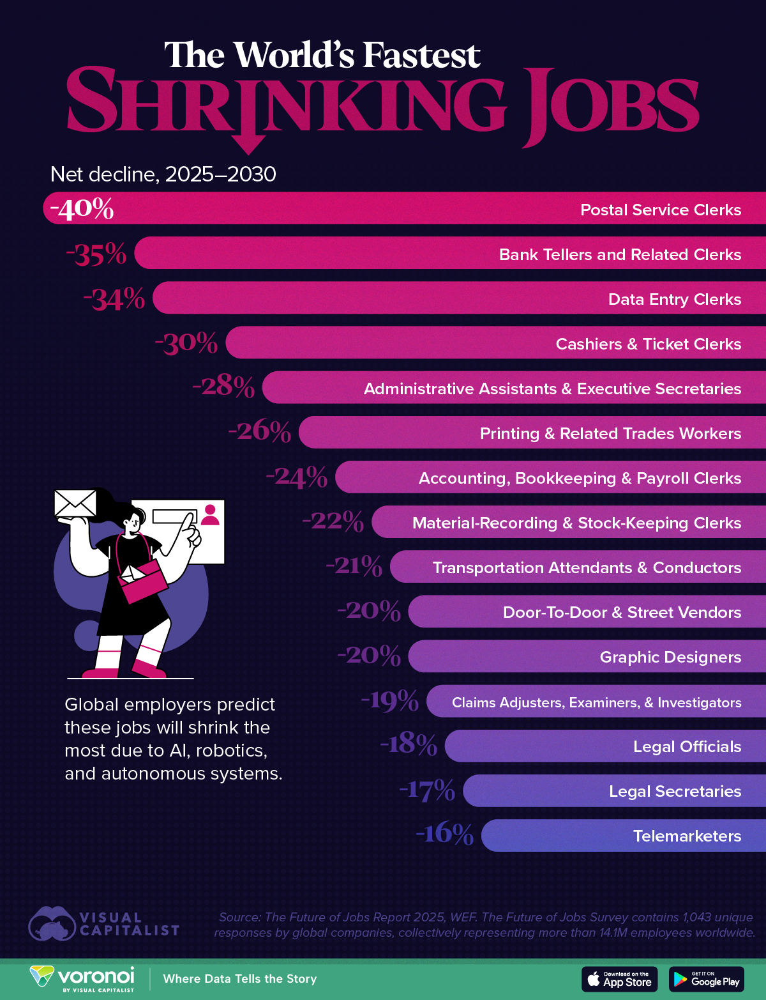
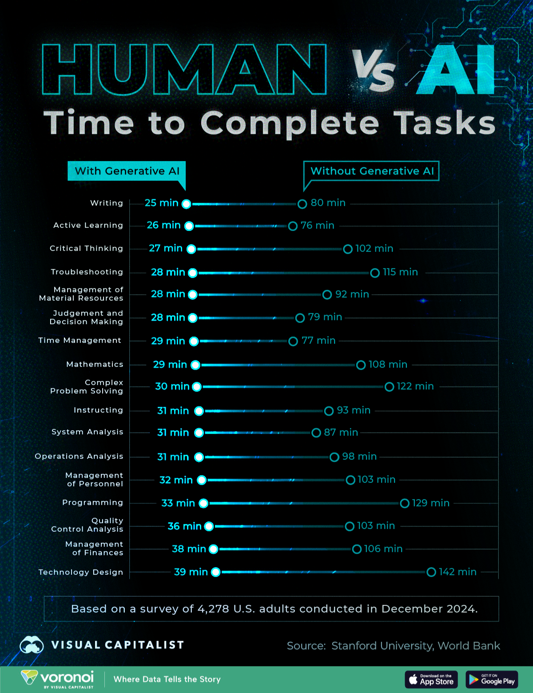

# ChatGPT e Redução de Danos
### Estratégias para driblar a Inteligência Artificial em sala de aula


Marina de Freitas


---
## Quem são vocês?

#### Nome
#### Qual sua familiaridade com IA?
#### O que te trouxe aqui?

---

## Por que _eu_ vou falar sobre esse tema hoje?
## Por que _eu_ propus essa conversa?

---

### Minhas credenciais para esse trabalho

- 2018 - 2022 :  pesquisas sobre a relação entre Tecnologia e Sociedade, etc.
- 2015/2023 - 2025 :  Educadora de Programação, Robótica, Informática, I, etc.
- 2025 - . . . :   Cientista de dados/Engenharia Experimental

---
### Minha proposta para o curso

- Falar um pouco sobre o que é, como funciona, como tem sido usada.
- Um pouco dos impactos no trabalho.
- Conversar sobre estratégias para lidar com a IA em sala de aula, especialmente quando usamos computador ouc ou celular em aula.
-  Dar dicas de como usar ao nosso favor, e ao favor do aluno.

_visão ingênua?_
Vou ser prático e confiar que seremos críticos.

---
# O que é IA?

(respondam que eu vou anotar aqui)


---
### IA

 - IA não responde por lógica, responde por probabilidade.
	 - Quanto é 2 + 2?
	 - Ela não faz a conta, ela pesquisa qual a resposta com maior probabilidade de ser a "certa" para essa pergunta.
- Retorna a Resposta com maior probabilidade de ser a resposta que o usuário está perguntando.
- Calculadora de Probabilidade.
- IA não tem compromisso com a verdade, IA tem compromisso com a resposta.

---

### Uma Tecnologia 
### Produzida por
- Ciência, Computação, Mercado, Política

---

### Usada como/para

- Gerar conhecimento, ferramenta de trabalho, prduzir inovação, instrumento de poder.

---

### Com Consequências

- Ambientais, Sociais, Relação com o Trabalho, Política, Degradação do Conhecimento/Verdade, Aprimoramento de tecnologias já existentes, etc.

---

### Então não importa discutir se ela é boa ou má? Neutra?

---

#### Essencial trazer esses temas para sala de aula porque:

---



---
### IA: Tecnologia para Reconhecimento de padrões complexos

(Muito mais do que apenas ChatGPT)


---

### Exemplos

- Artificial intelligence (AI)-powered picture analysis is 90% more effective than conventional analysis in wildlife conservation efforts, freeing experts to focus on conservation plans.
- AI systems can boost cancer detection by up to 13%.
- Incorporating AI tools into food production processes can increase per-acre crop growth by up to 21%.


---

### Exemplos


---

### LLM:  Large Language Model

> Leu tudo que está na internet?
> Não, calculou a probabilidade de uma palavra vir depois da outra!
> "textos não rotulado usando aprendizado de máquina não-supervisionado"


---

### IA Generativa

> "criação de conteúdo novo, baseado em padrões identificados nos conjuntos de dados de treinamento"

<dev>

</dev>

O "**Teorema do Macaco Infinito"** afirma que um macaco digitando aleatoriamente em um teclado por um intervalo de tempo infinito irá quase certamente escrever a obra completa do Senhor dos Anéis."

---
### Exemplos de IA Generativa



---
### Quais as fontes mais consultadas pelas IA Generativas?
---




---

### Mas as pessoas tem usado ele como fonte?
---



---
### O que as pessoas tem perguntado para elas?
---




----
## IA vai acabar com os trabalhos? 

---


---

#### Engraçado que os mais que tem uma percepção mais positiva sobre ia também são os que tem maior convicção de que ia irá acabar com os trabalhos.

---


---
#### Trabalhos que mais vão diminuir com Ia: automatização e digitalização:

---





---
### O que já está acontecendo?

- Declínio de 13% na empregabilidade em empresas que adotaram a IA, principalmente na faixa etária de 22 a 25 anos.
- IA gen tende a substituir tarefas repetitivas e operacionais. 
- Mais difícil para jovens serem contratados -> Mais difícil adquirirem experiência
- O aprendizado dos jovens foi prejudicado nos últimos anos (pandemia, vício em celular, epidemia de fake news, etc.) -> Aumento das diferenças sociais -> Mais difícil para jovens em situações de vulnerabilidade serem contratados.


---

## No fim, o estudante quer conseguir trabalhar
### Como fazer a redução de danos das IAs?

---
## Dicas genéricas e poucos críticas

- Ser usado pelas IAs v.s. Usar as IA 
- Capacho da IA v.s. Senso de curiosidade
- Sentar e realizar as tarefas v.s. Trabalho Estratégico
- Ser substituído v.s. IA ser copiloto
- "Tecnólogo Criativo": Engenheiro de Prompt e Médico de Alucinações
- Entender como usar IA — ou pelo menos ter um senso de curiosidade para aprender

---
## Desenvolvimento da autonomia e Resolução de Problemas

Desafios que não tem como objetivo alcançar a "resposta certa", que não tem um fim definido
- Aprendizagem por projetos, Metodologias Ativas, etc.
- Foco no trajeto, não no objetivo.
- Múltiplos objetivos/metas

Exemplo:
 - Criar um formulário de inscrição . . .
 - Adicionar validação de campos . . .
 - Melhorar a validação . . . 

Isso exige mais tutoria individual, mais correria.

---
## Desenvolver o trabalho em equipe

- Atividades em grupo em que cada um precisa desenvolver sua parte e fazer funcionar no final.

---
## Pensamento Crítico

- Explicar as alucinações das IAs generativas
- Mostrar Exemplos absurdos
- Em atividades práticas -> apontar os erros
- Entender o funcionamento 
	- Deepfake: https://aliaksandrsiarohin.github.io/first-order-model-website

---

## Atividades

Fazer pesquisas exclusivas em plataformas e sites específicos:
> 	Wikipedia, Info escola, W3school

Certificação da informação
 > Conversar com o chat e fazer ele alucinar.
> 	Exigir links da origem das informações
> 	Provocações para investigar a veracidade das informações passadas pela IA pesquisas   

---
## IA como Tutor

- Trabalhar a motivação individual para aprender.
- Customização do aprendizado.
- Autonomia para estudar.

 > "Me diz como faz sem me dar a resposta."

---
## Radical

- Aplicação de tutorial offline.
- Livros, sites, pdf com tutoriais + desligar o cabo de rede.

---
## Preparação para o mundo do trabalho

> "Quer usar, usa, mas eu não posso perceber."

- Texto em tópicos.
- Repetição do conteúdo.
- Sujeito geralmente não está oculto.
- Formatação do texto toda avacalhada.
- Repetição de preposição.
> As respostas são coerentes com o nível do exercício?

---

## Utilitarista

> Como elas podem me ajudar?
 
- Criar dados, exercícios, textos para estudo, atividades.
- Escrever documentos burocráticos.
-  . . .
 
---

## Redução de danos: como IA pode me ajudar?

---



---
##  A tal Engenharia de Prompt: 13 regras

---
## 1. Instrução 
### Normalmente verbo (resumir, criar, . . .)

---
## 2. Ideia
### indique o que deseje

---

## 3. Objetivo
### propósito da resposta (informar, persuadir, . . .)

---
## 4. Contexto
### forneça informações, contexto, dados, público alvo para a geração de conteúdo

> o que é contexto?

---
## 5. Tom
### especifique o tom desejado (formal, leve, acadêmico)

---

## 6. Atue como . . .

###  indique um papel a ser atuado
### como um pesquisador, como um professor, como um aluno, etc.

> Pode ser treinado para isso!

---
## 7. Escopo
### determine os limites ou a abrangência (conteúdo para ensino médio, física, no brasil, etc.)

---

## 8. Palavras-chave
### termos importantes a serem incluídos ou excluídos

---
## 9. Limitação

### não usar linguajar impróprio, não ser rascista, não ser homfóbico, etc.

---

## 10. Fotmato
### em lista, em markdown, parágrafos, sem emojis

> markdown?
> https://www.markdownguide.org/cheat-sheet/

---

## 11. Aprender
### ensinar o modelo a ser alguém

---
## 12. Premissas ocultas
### que premissas ocultas devem ser assumidas?

---
## 13. Melhorias
### Feedback, informar como a ia pode melhorar o que foi enviado

---
## Um esqueleto para deixar as marcas explícitas
```html
<role> </role>
<context></context>
<constraints> </constraints> 
<goals> </goals> 
<instructions> </instructions>
<output_format> </output_format>
<user_input> </user_input>
```   
  

---
## Dicas de ferramentas

"Tem uma IA para isso"
> [https://theresanaiforthat.com/](https://theresanaiforthat.com/)

Pesquisa em Documentos (assistente offline)
 > [https://theresanaiforthat.com/ai/hyperlink-by-nexa-ai/](https://theresanaiforthat.com/ai/hyperlink-by-nexa-ai/)
 
Transforma fotos em imagens de colorir para imprimir
> [https://theresanaiforthat.com/ai/colorart-ai/](https://theresanaiforthat.com/ai/colorart-ai/)


---

# Obrigada!


